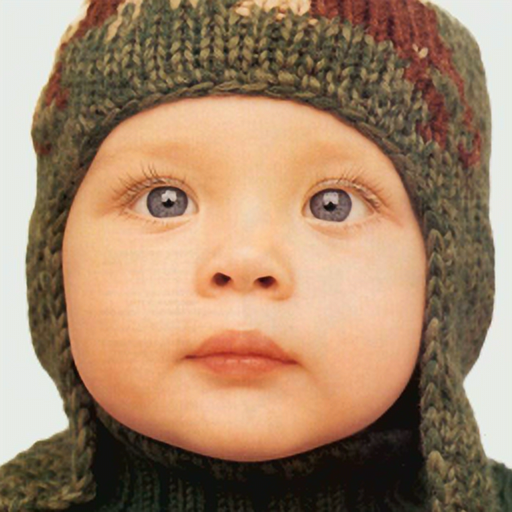

# [Pytorch] Reimplementation Super-Resolution using Multi-Step Reinforcement Learning

[](https://github.com/Nhat-Thanh/PixelRL-SR)

Reimplementation of Super-Resolution model using Reinforcement learning based on **Multi-Step Reinforcement Learning for Single Image Super-Resolution** paper with Pytorch.

## Contents

- [Introduction](#introduction)
- [Train](#train)
- [Test](#test)
- [Demo](#demo)
- [Evaluate](#evaluate)
- [References](#references)

## **Introduction**

This implementation uses [PixelRL](https://arxiv.org/abs/1912.07190) as the core reinforcement learning model. We utilized two models from the previous implementation by [Nhat-Thanh](https://github.com/Nhat-Thanh/), namely `ESPCN` and `FSRCNN`. Additionally, we incorporated two Transformer-based models, `SwinFIR` and `SwinIR`, which are currently performing well in the [ranking for Super-Resolution models](https://paperswithcode.com/task/image-super-resolution). These models are used for actions instead of `EDSR` and `ESRGAN` as mentioned in the original paper.

Since changing the actions is straightforward, you can easily use other super-resolution models as your actions. We have ignored the patch-wise agent and kept `t_max=5` as specified in the [PixelRL](https://arxiv.org/abs/1912.07190) paper.

<div align="center">
	<table>
		<thead>
			<tr>
				<th>Index</th>
				<th>Action</th>
			</tr>
		</thead>
		<tbody>
			<tr>
				<td>0</td>
				<td>pixel value -= 1</td>
			</tr>
			<tr>
				<td>1</td>
				<td>do nothing</td>
			</tr>
			<tr>
				<td>2</td>
				<td>pixel value += 1</td>
			</tr>
			<tr>
				<td>3</td>
				<td><a href="https://github.com/Nhat-Thanh/ESPCN-Pytorch">ESPCN</a></td>
			</tr>
			<tr>
				<td>4</td>
				<td><a href="https://github.com/Nhat-Thanh/FSRCNN-Pytorch">FSRCNN</a></td>
			</tr>
			<tr>
				<td>5</td>
				<td><a href="https://github.com/Zdafeng/SwinFIR">SwinFIR</a></td>
			</tr>
			<tr>
				<td>6</td>
				<td><a href="https://github.com/JingyunLiang/SwinIR">SwinIR</a></td>
			</tr>
		</tbody>
	</table>
<b>The actions.</b>

</div>

## Train

Dataset:

- Train: T91 + General100 + BSD200
- Validation: Set14
- Test: Set5, Set14, BSD100, URBAN100

You run this command to begin the training:

```
python train.py --scale=2              \
                --steps=2000           \
                --batch-size=64        \
                --save-every=50        \
                --save-log=0           \
                --ckpt-dir="checkpoint/x2"
```

- **--save-log**: if it's equal to **1**, **train loss, train rewards, train metrics, validation rewards, validation metrics** will be saved every **save-every** steps.

**NOTE**: if you want to re-train a new model, you should delete all files in **checkpoint** sub-directory. Your checkpoint will be saved when above command finishs and can be used for the next times, so you can train a model on **Lightning AI** without taking care of GPU time limit.

We trained the models on **Lightning AI** in **2000 steps** each of the models with a **NVIDIA T4** as the graphics card:
<a target="_blank" href="https://lightning.ai/cristy17001/studios/tsi-project">

</a>

You can download the models here:

- [PixelRL_SR-x2.pt](checkpoint/x2/PixelRL_SR-x2.pt) - Training time: approximately 7 hours 30 minutes
- [PixelRL_SR-x3.pt](checkpoint/x3/PixelRL_SR-x3.pt) - Training time: approximately 4 hours 15 minutes
- [PixelRL_SR-x4.pt](checkpoint/x4/PixelRL_SR-x4.pt) - Training time: approximately 4 hours

## Test

We use **Set5**, **Set14**, **BSD100** and **URBAN100** as the test set. After Training, you can test models with scale factors **x2, x3, x4**, the result is the average **PSNR** of all images.

```
python test.py --scale=2 --ckpt-path="default" --test-set="BSD100"
```

**--ckpt-path="default"** mean you are using default model path, aka **checkpoint/x{scale}/PixelRL_SR-x{scale}.pt**. If you want to use your trained model, you can pass yours to **--ckpt-path**.

**--test-set="BSD100"** corresponds to the dataset that will be used to take the **PSNR** and **AVG REWARD** of the model. In this example the selected set is the **BSD100**.

## Demo

After Training, you can test models with this command, the result is the **sr.png**.

```
python demo.py --scale=2             \
               --ckpt-path="default" \
               --draw-action-map=0   \
               --image-path="dataset/test1.png"
```

**--draw-action-map**: If it's equal to **1**, an action map will be save to **action_maps** directory every step.

**--ckpt-path** is the same as in [Test](#test)

## Evaluate

I evaluated models with Set5, Set14, BSD100 and Urban100 dataset by PSNR, the Bold texts are the best results:

<div align="center">
  <table border="1">
    <tr>
        <th style="width: 200px; text-align: center">Dataset</th>
        <th style="width: 200px; text-align: center">Scale</th>
        <th style="width: 200px; text-align: center">Bicubic</th>
        <th style="width: 200px; text-align: center">ESPCN</th>
        <th style="width: 200px; text-align: center">FSRCNN</th>
        <th style="width: 200px; text-align: center">SwinIR</th>
        <th style="width: 200px; text-align: center">SwinFIR</th>
        <th style="width: 200px; text-align: center">Previous_PixelRL-SR</th>
        <th style="width: 200px; text-align: center">OUR_PixelRL-SR</th>
    </tr>
    <tr style="text-align: center;">
        <td rowspan="3"><strong>Set5</strong></td>
        <td>2</td>
        <td>32.0500</td>
        <td>38.2830</td>
        <td>38.7593</td>
        <td>38.42</td>
        <td>38.67</td>
        <td>38.7633</td>
        <td><strong>38.7848</strong></td>
    </tr>
    <tr style="text-align: center;">
        <td>3</td>
        <td>28.8415</td>
        <td>34.6919</td>
        <td>34.5420</td>
        <td>34.97</td>
        <td><strong>35.16</strong></td>
        <td>34.6914</td>
        <td>34.6919</td>
    </tr>
    <tr style="text-align: center;">
        <td>4</td>
        <td>26.8905</td>
        <td>32.0646</td>
        <td>31.9589</td>
        <td>32.92</td>
        <td><strong>33.20</strong></td>
        <td>32.0646</td>
        <td>32.0646</td>
    </tr>
    <tr style="text-align: center;">
        <td rowspan="3"><strong>Set14</strong></td>
        <td>2</td>
        <td>28.5027</td>
        <td>34.4974</td>
        <td>34.5086</td>
        <td>34.46</td>
        <td><strong>34.94</strong></td>
        <td>34.4900</td>
        <td>34.5005</td>
    </tr>
    <tr style="text-align: center;">
        <td>3</td>
        <td>25.8909</td>
        <td>31.3246</td>
        <td>31.2409</td>
        <td>30.93</td>
        <td>31.25</td>
        <td><strong>31.3248</strong></td>
        <td>31.3246</td>
    </tr>
    <tr style="text-align: center;">
        <td>4</td>
        <td>24.3709</td>
        <td>29.2934</td>
        <td>29.3272</td>
        <td>29.09</td>
        <td>29.36</td>
        <td>29.3933</td>
        <td><strong>29.3934</strong></td>
    </tr>
    <tr style="text-align: center;">
        <td rowspan="3"><strong>BSD100</strong></td>
        <td>2</td>
        <td>28.3979</td>
        <td>34.3377</td>
        <td><strong>34.4503</strong></td>
        <td>32.53</td>
        <td>32.66</td>
        <td>34.4501</td>
        <td>34.4480</td>
    </tr>
    <tr style="text-align: center;">
        <td>3</td>
        <td>25.9977</td>
        <td>31.3524</td>
        <td>31.2723</td>
        <td>29.46</td>
        <td>29.56</td>
        <td><strong>31.3525</strong></td>
        <td>31.3524</td>
    </tr>
    <tr style="text-align: center;">
        <td>4</td>
        <td>24.7431</td>
        <td><strong>29.7331</strong></td>
        <td>29.6845</td>
        <td>27.92</td>
        <td>28.03</td>
        <td><strong>29.7331</strong></td>
        <td><strong>29.7331</strong></td>
    </tr>
    <tr style="text-align: center;">
        <td rowspan="3"><strong>Urban100</strong></td>
        <td>2</td>
        <td>25.3959</td>
        <td>31.6791</td>
        <td>31.6858</td>
        <td>33.81</td>
        <td><strong>34.59</strong></td>
        <td>31.6963</td>
        <td>31.6863</td>
    </tr>
    <tr style="text-align: center;">
        <td>3</td>
        <td>X</td>
        <td>X</td>
        <td>X</td>
        <td>X</td>
        <td>X</td>
        <td>X</td>
        <td>X</td>
    </tr>
    <tr style="text-align: center;">
        <td>4</td>
        <td>21.8013</td>
        <td>27.0724</td>
        <td>27.0038</td>
        <td>27.45</td>
        <td><strong>28.14</strong></td>
        <td>27.0724</td>
        <td>27.0724</td>
    </tr>
</table><br/>

<div style="white-space: nowrap; margin-top: 10px">
  
  
  
</div>
<b>Baby from Set5(img_001), Bicubic (left), PixelRL-SR x2 (center), High Resolution (right).</b>


<div style="white-space: nowrap; margin-top: 10px">
  
  
  
</div>
<b>Building(img_005) from URBAN100, Bicubic (left), PixelRL-SR x2 (center), High Resolution (right).</b>

<div style="white-space: nowrap; margin-top: 10px">
  
  
  
</div>
<b>Person from Set14(img_008), Bicubic (left), PixelRL-SR x2 (center), High Resolution (right).</b>

</div>

## References

- Original Paper Reference for PixelRL: https://arxiv.org/abs/1912.07190
- Papers with code reference for the model: https://paperswithcode.com/paper/multi-step-reinforcement-learning-for-single
- Original Implementation of PixelRL with pytorch: https://github.com/Nhat-Thanh/PixelRL-SR
- Swinir: https://github.com/JingyunLiang/SwinIR
- SwinFIR: https://github.com/Zdafeng/SwinFIR
- Set5: https://filebox.ece.vt.edu/~jbhuang/project/selfexsr/Set5_SR.zip
- Set14: https://filebox.ece.vt.edu/~jbhuang/project/selfexsr/Set14_SR.zip
- BSD100: https://filebox.ece.vt.edu/~jbhuang/project/selfexsr/BSD100_SR.zip
- Urban100: https://filebox.ece.vt.edu/~jbhuang/project/selfexsr/Urban100_SR.zip
